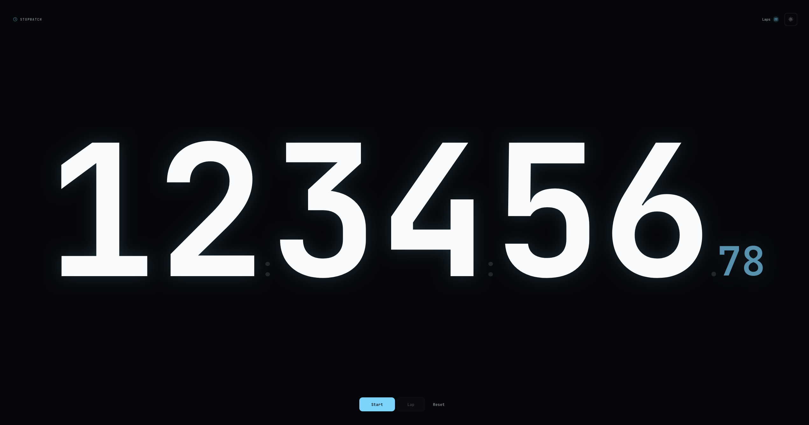

[](https://github.com/mcckyle/react-stopwatch/actions/workflows/deploy.yml)
[](./LICENSE)

# react-stopwatch

A simple, modern stopwatch built with **React** and **Vite**.

Designed around a fullscreen, distraction-free experience with a giant time display, keyboard controls, lap history, persistent laps, and light/dark themes.

[**Live Demo →**](https://mcckyle.github.io/react-stopwatch/)



---

## Features

- Full-width, fullscreen stopwatch display
- Start, pause, reset, and lap controls
- Keyboard shortcuts for core actions
- Persistent lap history with `localStorage`
- Lap duration deltas
- Fastest and slowest lap highlighting
- Light and dark themes
- Responsive desktop and mobile layouts
- Accessible controls and semantic markup
- Reduced-motion support
- No UI framework or component libraries

### Keyboard shortcuts

| Key | Action |
| --- | --- |
| `Space` | Start / pause |
| `L` | Record lap |
| `R` | Reset |
| `Shift + ?` | Open help |

---

## Tech Stack

| Technology | Purpose |
| --- | --- |
| [React](https://react.dev/) | User interface |
| [Vite](https://vite.dev/) | Development and production tooling |
| CSS Modules | Component-scoped styling |
| CSS | Design system, responsive layout, themes, and motion |
| `localStorage` | Persistent lap history |

---

## Getting Started

Clone the repository and install dependencies:

```bash
git clone https://github.com/mcckyle/react-stopwatch.git
cd react-stopwatch
npm install
```

Start the development server:

```bash
npm run dev
```

Build for production:

```bash
npm run build
```

---

## Project Structure

```
react-stopwatch/
├── .github/              # GitHub workflows (CI/CD).
├── public/               # Static assets (served as-is).
├── src/                  # Application Source code.
│   ├── components/       # Reusable React components.
│   │   ├── Stopwatch/
│   │   │   ├── Stopwatch.jsx
│   │   │   └── Stopwatch.module.css
│   │   │
│   │   ├── StopwatchHeader/
│   │   │   ├── StopwatchHeader.jsx
│   │   │   └── StopwatchHeader.module.css
│   │   │
│   │   ├── StopwatchDisplay/
│   │   │   ├── StopwatchDisplay.jsx
│   │   │   └── StopwatchDisplay.module.css
│   │   │
│   │   ├── StopwatchControls/
│   │   │   ├── StopwatchControls.jsx
│   │   │   └── StopwatchControls.module.css
│   │   │
│   │   ├── LapList/
│   │   │   ├── LapList.jsx
│   │   │   └── LapList.module.css
│   │   │
│   │   ├── HelpModal/
│   │   │   ├── HelpModal.jsx
│   │   │   └── HelpModal.module.css
│   │   │
│   │   └── theme.css
│   │     
│   ├── hooks/            # Custom React hooks.
│   │   ├── useStopwatch.js
│   │   └── useKeyboardShortcuts.js
│   │
│   ├── context/
│   │   └── ThemeContext.jsx
│   │
│   ├── utils/
│   │   └── formatTime.jsx
│   │
│   ├── __tests__/
│   │   ├── Stopwatch.test.jsx
│   │   ├── StopwatchDisplay.test.jsx
│   │   ├── StopwatchControls.test.jsx
│   │   └── LapList.test.jsx
│   │
│   ├── test/
│   │   └── test-utils.jsx
│   │
│   ├── App.jsx           # Main React application component.
│   ├── main.jsx          # React DOM entry point.
│   ├── App.css           # Styles specific to App.jsx.
│   └── index.css         # Global document-level styles.
│
├── .gitignore            # Specifies intentionally untracked files and folders to ignore.
├── LICENSE               # Open source license for the project.
├── README.md             # Project overview, instructions, and documentation.
├── eslint.config.js      # ESLint configuration.
├── index.html            # HTML entry point.
├── setUpTests.js         # Global setup for Jest tests.
├── vite.config.js        # Vite config for build and development.
├── package.json          # Project metadata, dependencies, and scripts.
└── package-lock.json     # Exact versions of installed dependencies.
```

---

## Design Principles

The interface is intentionally built around a small set of principles:

1. Time first - The stopwatch display dominates the viewport. Supporting controls stay visually secondary.

2. Simple by default - The application avoids unnecessary panels, decoration, dependencies, and interaction layers.

3. Responsive by design - The same composition adapts from large desktop displays to smaller touch devices without turning into a separate mobile interface.

4. Accessible interaction - Semantic HTML, keyboard controls, visible focus states, accessible labels, and reduced-motion support are treated as part of the interface rather than afterthoughts.

5. Explicit styling - The project uses native CSS and CSS modules instead of a general-purpose component library, keeping the visual system small and understandable.

---

## Roadmap

- [x] Core stopwatch functionality
- [x] Start / pause / reset controls
- [x] Lap functionality
- [x] Keyboard shortcuts
- [x] Persistent lap history
- [x] Lap time deltas
- [x] Fastest and slowest lap highlighting
- [x] Clear lap history
- [x] Light / dark themes
- [x] Responsive layout
- [x] Reduced-motion support
- [ ] Export laps to CSV or JSON

---

## License

This project is licensed under the [MIT License](./LICENSE).

---

## Acknowledgments

This project was made possible thanks to the open-source community and the following technologies:

- [React](https://react.dev) - A modern library designed specifically for building fast, interactive UIs.
- [Vite](https://vitejs.dev/) - Next-generation frontend tooling with lightning-fast dev server and build optimizations.

Special thanks to the broader open-source ecosystem for the inspiration and tools that empower developers to create and share freely.
